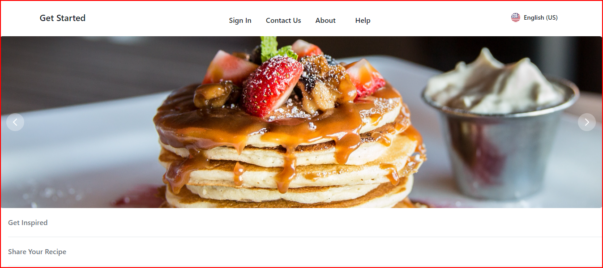

# Project-1 What's In Your Fridge?
## Description
Welcome to "What's "In Your Fridge!" A simple application that allows users to search for recipes based on the ingredients that are available to them.

## Project URL
<https://github.com/RyanSKang/Whats-In-Your-Fridge>
## Deployment

- [https://ryanskang.github.io/Whats-In-Your-Fridge/](https://ryanskang.github.io/Whats-In-Your-Fridge/)

## Demo/Screenshot

<table>
<tr>
<td>What's In Your Fridge?</td>
</tr>
<tr>
<td></td>
</tr>
</table>

## Technologies

HTML, CSS, Javascript, Jquery, Tailwind, Flowbite

## License

NA

## Resources

-[w3schools](https://www.w3schools.com/)
-[FlexboxFroggy](https://flexboxfroggy.com/)
-[CSS-Tracks](https://css-tricks.com/)
-[Youtube](https://www.youtube.com/watch?v=1Rs2ND1ryYc)
-[Unsplash](https://unsplash.com/s/photos/hero-header)
-[pixabay](https://pixabay.com/illustrations
 cloud-computer-circuit-board-cpu-6532831/)
-[Devon Abbott](http://dabbott.github.io/javascript-playgrounds/)
- [pexels](https://www.pexels.com/)
- [tailwind](https://tailwindcss.com/docs/installation)
- [flowbite](https://flowbite.com/docs/getting-started/introduction/)

## Contact

Email: sasasa@gmail.com

## Author
Author: Taylor Knox
GitHub: <https://github.com/knaxilla>

Author: Ryan Kang
GitHub: <https://github.com/RyanSKang>

Author: Sachi Takaoka
GitHub: <https://github.com/kaleikautakaoka>
